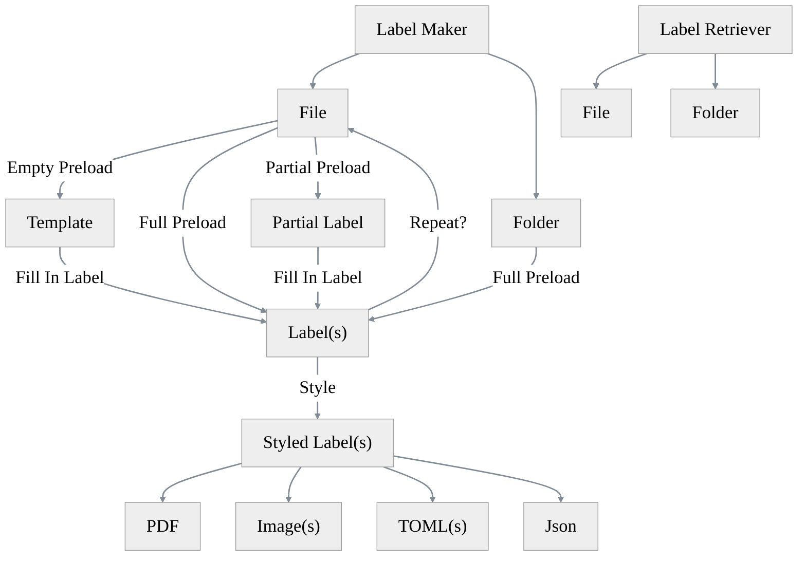
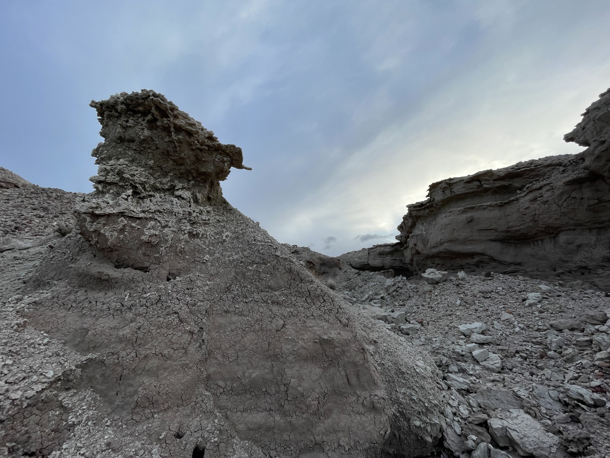

# Paleontological Labels

_`paleo-labels` is an application for writing precisely formatted labels singularly or in bulk for use with paleontological specimens, collections, and excursions._

This repository is in the earliest stages of development—there is not currently a minimum viable product yet—so please be patient and return in due course. Any suggestions or ideas would be appreciated, however, and can be provided as an issue in this repository (see [here](https://github.com/AFg6K7h4fhy2/paleo-labels/issues)) or email (see [here](https://github.com/AFg6K7h4fhy2#contact)).

## Utility Diagram

See [here](https://www.mermaidchart.com/play#pako:eNqrVkrOT0lVslJSqgUAFW4DVg) for the live Mermaid diagram editor.

 A scene of strata of the latest Pliocene of Arizona, USA. 

